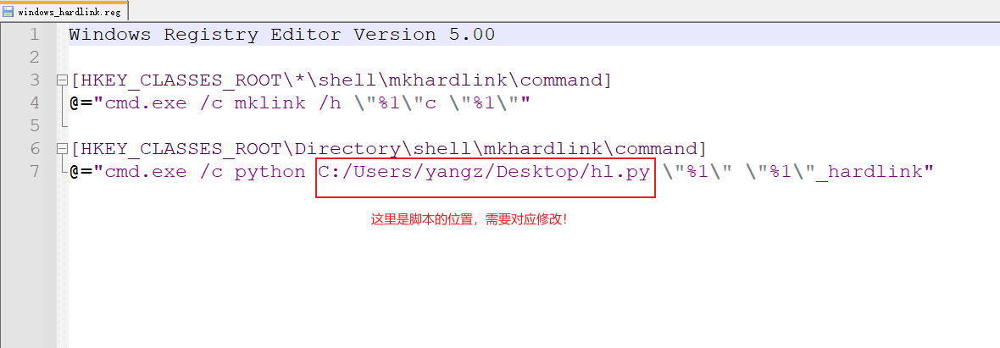
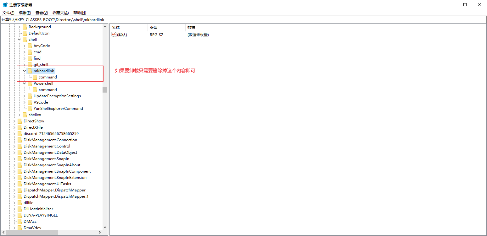
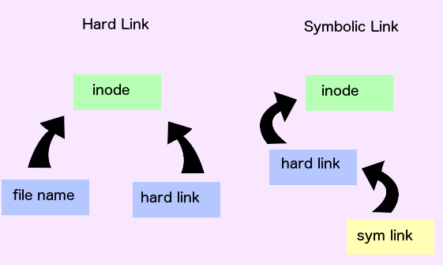

# Windows Hard Link

在Windows系统中为文件夹创建hardlink

## 功能演示


## 安装方法

### 默认方法

- 把根目录的`hl.py`文件放在**桌面**，*以后如果要用这个功能就需要一直放在桌面！*
- 运行`windows_hardlink.reg`添加注册表信息

### 自定义脚本文件位置

- 修改`windows_hardlink.reg`中脚本文件的位置为`hl.py`所在的位置
- 
- 运行`windows_hardlink.reg`添加注册表信息

### 卸载

把之前添加的注册表信息删除即可



## 原理解释

### 是什么？

- `hardlink（硬链接）`是一个操作系统层面的文件指针，在用户眼中和普通的文件无异（因为所有的文件本质上就是指向数据的一个指针）。通常区别于`symbollink（软链接）`。特别地，在Windwos下还区别于`shortcut（快捷方式）`和 `junction（目录联接）`
- 使用`CMD`的`mklink`命令可以创建这几类链接（快捷方式较为特殊，有另外的创建方法，这里不赘述）
```cmd
> mklink
创建符号链接。

MKLINK [[/D] | [/H] | [/J]] Link Target

        /D      创建目录符号链接。默认为文件
                符号链接。
        /H      创建硬链接而非符号链接。
        /J      创建目录联接。
        Link    指定新的符号链接名称。
        Target  指定新链接引用的路径
                (相对或绝对)。
```
- 硬链接的特性：
  - **硬链接只能用于单个文件，不能用于文件夹**
  - 硬链接本身不占用额外的空间。
  - 如果你修改了硬链接文件的内容，那么源文件也会被修改。
  - 如果你删除了源文件或者硬链接，另外一份依然保留，不受影响。
- 下面的图应该能帮助你更好的理解硬链接


### 为什么？
- 我在Windows上搭建**Plex媒体库**的时候，经常由于文件名不规范而导致刮削失败。
- 但同时，由于需要做种，不方便修改源文件的名称。
- 所以需要硬链接，来达成既可以随意修改文件名称，又不占用额外空间，又能不改变源文件的目标！

### 怎么办？
#### 递归创建hardlink
由于硬链接不支持文件夹，想要实现整个文件夹的"harklink"那只能递归实现（我打算用python脚本），也就是保持源文件夹的目录结构，对每个文件创建硬链接，从而曲线救国。

根目录的脚本文件运行示例：

```cmd
> python hl.py example output
('运行的脚本', 'hl.py')
('源目录', 'example')
('目标目录', 'output')
为 output\130218(final).pdf <<===>> example\130218(final).pdf 创建了硬链接
为 output\script\readme.txt <<===>> example\script\readme.txt 创建了硬链接
为 output\script\Python\hello.py <<===>> example\script\Python\hello.py 创建了硬链接
为 output\script\R\hello.r <<===>> example\script\R\hello.r 创建了硬链接
为 output\txt\a <<===>> example\txt\a 创建了硬链接
为 output\txt\hello.txt <<===>> example\txt\hello.txt 创建了硬链接
```

#### 添加到注册表
并且如果每次都写一个脚本，打开命令行来运行，实在是有些麻烦。我想到用**Windows的右键菜单**来实现一键操作：

（下图点击`创建mkhardlink`即可创建！）


